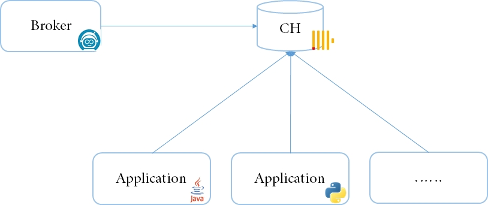

# Zeebe ClickHouse Exporter

[Exporters](https://docs.camunda.io/docs/next/components/zeebe/technical-concepts/architecture/#exporters) allow you to tap into the Zeebe event stream on a partition and export selected events to other systems. You can filter events, perform transformations, and even trigger side-effects from an exporter.

Read a two-part series about building Zeebe exporters on the Zeebe blog: [Part One](https://camunda.com/blog/2019/05/exporter-part-1/) | [Part Two](https://camunda.com/blog/2019/06/exporter-part-2/).

This [Zeebe ClickHouse Exporter](https://github.com/skayliu/zeebe-clickhouse-exporter) is build on [Zeebe Exporter Demo](https://github.com/jwulf/zeebe-exporter-demo.git) and [ClickHouse Java Libraries](https://github.com/ClickHouse/clickhouse-java.git).

You can export records from Zeebe to ClickHouse and query data from ClickHouse use you own program language.




## About ClickHouse

[ClickHouse](https://clickhouse.com/clickhouse) is a column-oriented database that enables its users to generate powerful analytics, using SQL queries, in real-time.

ClickHouse is an Open Source OLAP database management system. 

ClickHouse runs on ClickHouse Cloud or any Linux, FreeBSD, or macOS system with x86_64, AArch64, or PowerPC64LE CPU architecture. 

[ClickHouse Quick Start](https://clickhouse.com/docs/en/getting-started/quick-start/) follow these steps to get up and running with ClickHouse.

[ClickHouse Java Libraries](https://github.com/ClickHouse/clickhouse-java) for connecting to ClickHouse and processing data in various formats. Java client is async, lightweight, and low-overhead library for ClickHouse

[ClickHouse Asynchronous Inserts](https://clickhouse.com/docs/en/cloud/bestpractices/asynchronous-inserts) inserting data into ClickHouse in large batches is a best practice.

## Deploy the  Exporter

1. Build the exporter, using `mvn package`.
2. Copy the resulting `zeebe-clickhouse-exporter-1.0-SNAPSHOT.jar` file to the `exporters` directory of your Zeebe broker.
3. Edit the `application.xml` file, and add an entry for the exporter:

```
    exporters:
      clickhouse:
        className: io.zeebe.clickhouse.exporter.ClickHouseExporter
        jarPath: exporters/zeebe-clickhouse-exporter-1.0-SNAPSHOT.jar
        args:
          chUrl: jdbc:ch://127.0.0.1:8123/default
          chUser: default
          chPassword: clickhouse123
```

## ClickHouse Zeebe Tables

```
chk :) show tables;

SHOW TABLES

Query id: e18a6412-c726-48d2-b73b-6e78c0af3b12

┌─name─────────────────┐
│ CLICKHOUSE_CONFIG    │
│ ELEMENT_INSTANCE     │
│ ERROR                │
│ INCIDENT             │
│ JOB                  │
│ MESSAGE              │
│ MESSAGE_SUBSCRIPTION │
│ PROCESS              │
│ PROCESS_INSTANCE     │
│ TIMER                │
│ VARIABLE             │
└──────────────────────┘

11 rows in set. Elapsed: 0.002 sec.

chk :)
```

## ClickHouse Query Process Records
```
chk :) select KEY_,BPMN_PROCESS_ID_,RESOURCE_NAME_,TIMESTAMP_,PARTITION_ID_,POSITION_,VERSION_ from PROCESS;

SELECT
    KEY_,
    BPMN_PROCESS_ID_,
    RESOURCE_NAME_,
    TIMESTAMP_,
    PARTITION_ID_,
    POSITION_,
    VERSION_
FROM PROCESS

Query id: 3d27fd6a-87fb-4891-b27d-8b445ac7bc64

┌─────────────KEY_─┬─BPMN_PROCESS_ID_─┬─RESOURCE_NAME_───────┬──────────────TIMESTAMP_─┬─PARTITION_ID_─┬─POSITION_─┬─VERSION_─┐
│ 2251799813685986 │ Process_0k1nnh5  │ Process_0k1nnh5.bpmn │ 2023-03-11 12:56:00.614 │             1 │      1900 │        4 │
│ 2251799813686688 │ Process_0k1nnh5  │ Process_0k1nnh5.bpmn │ 2023-03-11 13:22:36.327 │             1 │      3704 │        5 │
│ 2251799813687390 │ Process_0k1nnh5  │ Process_0k1nnh5.bpmn │ 2023-03-11 13:45:48.440 │             1 │      5508 │        6 │
│ 2251799813687393 │ Process_0k1nnh5  │ Process_0k1nnh5.bpmn │ 2023-03-11 13:49:07.744 │             1 │      5513 │        7 │
│ 2251799813687395 │ Process_0k1nnh5  │ Process_0k1nnh5.bpmn │ 2023-03-11 13:50:22.217 │             1 │      5518 │        8 │
└──────────────────┴──────────────────┴──────────────────────┴─────────────────────────┴───────────────┴───────────┴──────────┘

5 rows in set. Elapsed: 0.003 sec.

chk :)
```

## ClickHouse Query Process Instance Records
```
chk :) select * from PROCESS_INSTANCE limit 10;

SELECT *
FROM PROCESS_INSTANCE
LIMIT 10

Query id: 790c13cc-5066-49c0-9068-4e6e610b8cf0

┌─────────────KEY_─┬─BPMN_PROCESS_ID_─┬─PROCESS_DEFINITION_KEY_─┬──────────────────START_─┬─END_─┬─PARTITION_ID_─┬─VERSION_─┬─STATE_─┬─PARENT_PROCESS_INSTANCE_KEY_─┬─PARENT_ELEMENT_INSTANCE_KEY_─┐
│ 2251799813685989 │ Process_0k1nnh5  │        2251799813685986 │ 2023-03-11 12:56:03.649 │ ᴺᵁᴸᴸ │             1 │        4 │ Active │                           -1 │                           -1 │
│ 2251799813685996 │ Process_0k1nnh5  │        2251799813685986 │ 2023-03-11 12:56:06.651 │ ᴺᵁᴸᴸ │             1 │        4 │ Active │                           -1 │                           -1 │
│ 2251799813686003 │ Process_0k1nnh5  │        2251799813685986 │ 2023-03-11 12:56:09.632 │ ᴺᵁᴸᴸ │             1 │        4 │ Active │                           -1 │                           -1 │
│ 2251799813686010 │ Process_0k1nnh5  │        2251799813685986 │ 2023-03-11 12:56:12.639 │ ᴺᵁᴸᴸ │             1 │        4 │ Active │                           -1 │                           -1 │
│ 2251799813686017 │ Process_0k1nnh5  │        2251799813685986 │ 2023-03-11 12:56:15.643 │ ᴺᵁᴸᴸ │             1 │        4 │ Active │                           -1 │                           -1 │
│ 2251799813686024 │ Process_0k1nnh5  │        2251799813685986 │ 2023-03-11 12:56:18.623 │ ᴺᵁᴸᴸ │             1 │        4 │ Active │                           -1 │                           -1 │
│ 2251799813686031 │ Process_0k1nnh5  │        2251799813685986 │ 2023-03-11 12:56:21.621 │ ᴺᵁᴸᴸ │             1 │        4 │ Active │                           -1 │                           -1 │
│ 2251799813686038 │ Process_0k1nnh5  │        2251799813685986 │ 2023-03-11 12:56:24.651 │ ᴺᵁᴸᴸ │             1 │        4 │ Active │                           -1 │                           -1 │
│ 2251799813686045 │ Process_0k1nnh5  │        2251799813685986 │ 2023-03-11 12:56:27.649 │ ᴺᵁᴸᴸ │             1 │        4 │ Active │                           -1 │                           -1 │
│ 2251799813686052 │ Process_0k1nnh5  │        2251799813685986 │ 2023-03-11 12:56:30.649 │ ᴺᵁᴸᴸ │             1 │        4 │ Active │                           -1 │                           -1 │
└──────────────────┴──────────────────┴─────────────────────────┴─────────────────────────┴──────┴───────────────┴──────────┴────────┴──────────────────────────────┴──────────────────────────────┘

10 rows in set. Elapsed: 0.003 sec.

chk :)
```

## ClickHouse Query Element Instance Records
```
chk :) select * from ELEMENT_INSTANCE where PROCESS_INSTANCE_KEY_=2251799813689134 order by TIMESTAMP_ asc;

SELECT *
FROM ELEMENT_INSTANCE
WHERE PROCESS_INSTANCE_KEY_ = 2251799813689134
ORDER BY TIMESTAMP_ ASC

Query id: ebbffa4f-c188-47b1-99a4-3d18e84645bb

┌─ID──────┬─────────────KEY_─┬─BPMN_PROCESS_ID_─┬─PROCESS_DEFINITION_KEY_─┬──────────────TIMESTAMP_─┬─INTENT_─────────────┬─PARTITION_ID_─┬─POSITION_─┬─PROCESS_INSTANCE_KEY_─┬──FLOW_SCOPE_KEY_─┬─ELEMENT_ID_──────┬─BPMN_ELEMENT_TYPE_─┐
│ 1-9991  │ 2251799813689134 │ Process_1udqk7z  │        2251799813685323 │ 2023-03-12 11:29:13.349 │ ELEMENT_ACTIVATING  │             1 │      9991 │      2251799813689134 │               -1 │ Process_1udqk7z  │ PROCESS            │
│ 1-9992  │ 2251799813689134 │ Process_1udqk7z  │        2251799813685323 │ 2023-03-12 11:29:13.349 │ ELEMENT_ACTIVATED   │             1 │      9992 │      2251799813689134 │               -1 │ Process_1udqk7z  │ PROCESS            │
│ 1-9994  │ 2251799813689137 │ Process_1udqk7z  │        2251799813685323 │ 2023-03-12 11:29:13.349 │ ELEMENT_ACTIVATING  │             1 │      9994 │      2251799813689134 │ 2251799813689134 │ StartEvent_1     │ START_EVENT        │
│ 1-9995  │ 2251799813689137 │ Process_1udqk7z  │        2251799813685323 │ 2023-03-12 11:29:13.349 │ ELEMENT_ACTIVATED   │             1 │      9995 │      2251799813689134 │ 2251799813689134 │ StartEvent_1     │ START_EVENT        │
│ 1-9997  │ 2251799813689137 │ Process_1udqk7z  │        2251799813685323 │ 2023-03-12 11:29:13.352 │ ELEMENT_COMPLETING  │             1 │      9997 │      2251799813689134 │ 2251799813689134 │ StartEvent_1     │ START_EVENT        │
│ 1-9998  │ 2251799813689137 │ Process_1udqk7z  │        2251799813685323 │ 2023-03-12 11:29:13.352 │ ELEMENT_COMPLETED   │             1 │      9998 │      2251799813689134 │ 2251799813689134 │ StartEvent_1     │ START_EVENT        │
│ 1-9999  │ 2251799813689138 │ Process_1udqk7z  │        2251799813685323 │ 2023-03-12 11:29:13.352 │ SEQUENCE_FLOW_TAKEN │             1 │      9999 │      2251799813689134 │ 2251799813689134 │ Flow_0j9gwbw     │ SEQUENCE_FLOW      │
│ 1-10001 │ 2251799813689139 │ Process_1udqk7z  │        2251799813685323 │ 2023-03-12 11:29:13.356 │ ELEMENT_ACTIVATING  │             1 │     10001 │      2251799813689134 │ 2251799813689134 │ Activity_0v39lo1 │ USER_TASK          │
│ 1-10003 │ 2251799813689139 │ Process_1udqk7z  │        2251799813685323 │ 2023-03-12 11:29:13.356 │ ELEMENT_ACTIVATED   │             1 │     10003 │      2251799813689134 │ 2251799813689134 │ Activity_0v39lo1 │ USER_TASK          │
└─────────┴──────────────────┴──────────────────┴─────────────────────────┴─────────────────────────┴─────────────────────┴───────────────┴───────────┴───────────────────────┴──────────────────┴──────────────────┴────────────────────┘

9 rows in set. Elapsed: 0.044 sec. Processed 9.09 thousand rows, 1.43 MB (204.70 thousand rows/s., 32.24 MB/s.)

chk :)
```

## ClickHouse Query Timer Records
```
chk :) select * from TIMER limit 10;

SELECT *
FROM TIMER
LIMIT 10

Query id: 96d218f8-7628-4a98-978a-d018bc420b8f

┌─────────────KEY_─┬─STATE_────┬─REPETITIONS─┬──────────────TIMESTAMP_─┬───────────────DUE_DATE_─┬─PROCESS_INSTANCE_KEY_─┬─PROCESS_DEFINITION_KEY_─┬─ELEMENT_INSTANCE_KEY_─┬─TARGET_ELEMENT_ID_─┐
│ 2251799813685987 │ triggered │         100 │ 2023-03-11 12:56:03.649 │ 2023-03-11 12:56:03.614 │      2251799813685989 │        2251799813685986 │                    -1 │ StartEvent_1       │
│ 2251799813685991 │ triggered │          99 │ 2023-03-11 12:56:06.651 │ 2023-03-11 12:56:06.614 │      2251799813685996 │        2251799813685986 │                    -1 │ StartEvent_1       │
│ 2251799813685998 │ triggered │          98 │ 2023-03-11 12:56:09.632 │ 2023-03-11 12:56:09.614 │      2251799813686003 │        2251799813685986 │                    -1 │ StartEvent_1       │
│ 2251799813686005 │ triggered │          97 │ 2023-03-11 12:56:12.639 │ 2023-03-11 12:56:12.614 │      2251799813686010 │        2251799813685986 │                    -1 │ StartEvent_1       │
│ 2251799813686012 │ triggered │          96 │ 2023-03-11 12:56:15.643 │ 2023-03-11 12:56:15.614 │      2251799813686017 │        2251799813685986 │                    -1 │ StartEvent_1       │
│ 2251799813686019 │ triggered │          95 │ 2023-03-11 12:56:18.623 │ 2023-03-11 12:56:18.614 │      2251799813686024 │        2251799813685986 │                    -1 │ StartEvent_1       │
│ 2251799813686026 │ triggered │          94 │ 2023-03-11 12:56:21.621 │ 2023-03-11 12:56:21.614 │      2251799813686031 │        2251799813685986 │                    -1 │ StartEvent_1       │
│ 2251799813686033 │ triggered │          93 │ 2023-03-11 12:56:24.651 │ 2023-03-11 12:56:24.614 │      2251799813686038 │        2251799813685986 │                    -1 │ StartEvent_1       │
│ 2251799813686040 │ triggered │          92 │ 2023-03-11 12:56:27.649 │ 2023-03-11 12:56:27.614 │      2251799813686045 │        2251799813685986 │                    -1 │ StartEvent_1       │
│ 2251799813686047 │ triggered │          91 │ 2023-03-11 12:56:30.649 │ 2023-03-11 12:56:30.614 │      2251799813686052 │        2251799813685986 │                    -1 │ StartEvent_1       │
└──────────────────┴───────────┴─────────────┴─────────────────────────┴─────────────────────────┴───────────────────────┴─────────────────────────┴───────────────────────┴────────────────────┘

10 rows in set. Elapsed: 0.003 sec.

chk :)
```
## ClickHouse Query Job Records
```
chk :) select * from JOB limit 10;

SELECT *
FROM JOB
LIMIT 10

Query id: b123ba7f-b552-4dba-9d66-9d30a9478a6d

┌─────────────KEY_─┬─BPMN_PROCESS_ID_─┬─ELEMENT_ID_──────┬─WORKER_─┬─JOB_TYPE_─────────────────┬─STATE_──┬─RETRIES_─┬──────────────────START_─┬─END_─┬─PROCESS_INSTANCE_KEY_─┬─ELEMENT_INSTANCE_KEY_─┬─PROCESS_DEFINITION_KEY_─┐
│ 2251799813685995 │ Process_0k1nnh5  │ Activity_0fhkw5l │         │ io.camunda.zeebe:userTask │ created │        1 │ 2023-03-11 12:56:03.649 │ ᴺᵁᴸᴸ │      2251799813685989 │      2251799813685994 │        2251799813685986 │
│ 2251799813686002 │ Process_0k1nnh5  │ Activity_0fhkw5l │         │ io.camunda.zeebe:userTask │ created │        1 │ 2023-03-11 12:56:06.651 │ ᴺᵁᴸᴸ │      2251799813685996 │      2251799813686001 │        2251799813685986 │
│ 2251799813686009 │ Process_0k1nnh5  │ Activity_0fhkw5l │         │ io.camunda.zeebe:userTask │ created │        1 │ 2023-03-11 12:56:09.632 │ ᴺᵁᴸᴸ │      2251799813686003 │      2251799813686008 │        2251799813685986 │
│ 2251799813686016 │ Process_0k1nnh5  │ Activity_0fhkw5l │         │ io.camunda.zeebe:userTask │ created │        1 │ 2023-03-11 12:56:12.639 │ ᴺᵁᴸᴸ │      2251799813686010 │      2251799813686015 │        2251799813685986 │
│ 2251799813686023 │ Process_0k1nnh5  │ Activity_0fhkw5l │         │ io.camunda.zeebe:userTask │ created │        1 │ 2023-03-11 12:56:15.643 │ ᴺᵁᴸᴸ │      2251799813686017 │      2251799813686022 │        2251799813685986 │
│ 2251799813686030 │ Process_0k1nnh5  │ Activity_0fhkw5l │         │ io.camunda.zeebe:userTask │ created │        1 │ 2023-03-11 12:56:18.623 │ ᴺᵁᴸᴸ │      2251799813686024 │      2251799813686029 │        2251799813685986 │
│ 2251799813686037 │ Process_0k1nnh5  │ Activity_0fhkw5l │         │ io.camunda.zeebe:userTask │ created │        1 │ 2023-03-11 12:56:21.621 │ ᴺᵁᴸᴸ │      2251799813686031 │      2251799813686036 │        2251799813685986 │
│ 2251799813686044 │ Process_0k1nnh5  │ Activity_0fhkw5l │         │ io.camunda.zeebe:userTask │ created │        1 │ 2023-03-11 12:56:24.651 │ ᴺᵁᴸᴸ │      2251799813686038 │      2251799813686043 │        2251799813685986 │
│ 2251799813686051 │ Process_0k1nnh5  │ Activity_0fhkw5l │         │ io.camunda.zeebe:userTask │ created │        1 │ 2023-03-11 12:56:27.649 │ ᴺᵁᴸᴸ │      2251799813686045 │      2251799813686050 │        2251799813685986 │
│ 2251799813686058 │ Process_0k1nnh5  │ Activity_0fhkw5l │         │ io.camunda.zeebe:userTask │ created │        1 │ 2023-03-11 12:56:30.649 │ ᴺᵁᴸᴸ │      2251799813686052 │      2251799813686057 │        2251799813685986 │
└──────────────────┴──────────────────┴──────────────────┴─────────┴───────────────────────────┴─────────┴──────────┴─────────────────────────┴──────┴───────────────────────┴───────────────────────┴─────────────────────────┘

10 rows in set. Elapsed: 0.002 sec.

chk :)
```

## ClickHouse Query Message Subscription Records
```
chk :) select * from MESSAGE_SUBSCRIPTION order by TIMESTAMP_ asc;

SELECT *
FROM MESSAGE_SUBSCRIPTION
ORDER BY TIMESTAMP_ ASC

Query id: 3da1ad48-3023-4e58-a17b-a671a87e7228

┌─ID_──────────────────────────────────┬─MESSAGE_NAME_───┬─MESSAGE_KEY_─┬──────────────TIMESTAMP_─┬─STATE_──┬─PROCESS_INSTANCE_KEY_─┬─ELEMENT_INSTANCE_KEY_─┬─PROCESS_DEFINITION_KEY_─┬─CORRELATION_KEY_─┬─TARGET_FLOW_NODE_ID_─┐
│ afd4a50b-0053-4e19-a5f5-74aac0013b04 │ Message_0l9728h │           -1 │ 2023-03-12 04:01:18.081 │ created │                    -1 │                    -1 │        2251799813687398 │                  │ StartEvent_1         │
│ e77d6a70-e93c-4521-88aa-3d1e4de46a95 │ Message_0l9728h │           -1 │ 2023-03-12 04:01:33.286 │ deleted │                    -1 │                    -1 │        2251799813687398 │                  │ StartEvent_1         │
│ fb7e88a0-79e3-42bd-8a30-d0bf9a887b6e │ Message_0l9728h │           -1 │ 2023-03-12 04:01:33.286 │ created │                    -1 │                    -1 │        2251799813687401 │                  │ StartEvent_1         │
└──────────────────────────────────────┴─────────────────┴──────────────┴─────────────────────────┴─────────┴───────────────────────┴───────────────────────┴─────────────────────────┴──────────────────┴──────────────────────┘

3 rows in set. Elapsed: 0.005 sec.

chk :)

```

## ClickHouse Query Message Records
```
chk :) select * from MESSAGE order by TIMESTAMP_ asc;

SELECT *
FROM MESSAGE
ORDER BY TIMESTAMP_ ASC

Query id: 4263bdf6-585e-4209-ab46-f25a2b0820d1

┌─────────────KEY_─┬─NAME_───────────┬──────────────TIMESTAMP_─┬─STATE_────┬─CORRELATION_KEY_─┬─MESSAGE_ID_─┬─PAYLOAD_────────┐
│ 2251799813687404 │ Message_0l9728h │ 2023-03-12 04:14:37.390 │ published │ 123              │             │ {x=1, y=2}      │
│ 2251799813687415 │ Message_0l9728h │ 2023-03-12 04:15:39.281 │ published │ 9876467          │             │ {x=1, y=2}      │
│ 2251799813687426 │ Message_0l9728h │ 2023-03-12 04:17:54.630 │ published │ 23223423         │             │ {x=11, y=29}    │
│ 2251799813687437 │ Message_0l9728h │ 2023-03-12 04:21:17.489 │ published │ 23233            │             │ {x=111, y=39}   │
│ 2251799813687448 │ Message_0l9728h │ 2023-03-12 04:22:19.181 │ published │ 238868823        │             │ {x=1121, y=339} │
└──────────────────┴─────────────────┴─────────────────────────┴───────────┴──────────────────┴─────────────┴─────────────────┘

5 rows in set. Elapsed: 0.006 sec.

chk :)

```

## ClickHouse Query Variable Records
```
chk :) select * from VARIABLE limit 5;

SELECT *
FROM VARIABLE
LIMIT 5

Query id: 43b29497-c340-4ee5-beed-769e56f46d62

┌─ID─────┬─NAME_─┬─VALUE_─┬──────────────TIMESTAMP_─┬─PARTITION_ID_─┬─POSITION_─┬─PROCESS_INSTANCE_KEY_─┬─PROCESS_DEFINITION_KEY_─┬───────SCOPE_KEY_─┬─STATE_──┐
│ 1-5544 │ x     │ "1"    │ 2023-03-12 04:14:37.390 │             1 │      5544 │      2251799813687405 │        2251799813687401 │ 2251799813687407 │ created │
│ 1-5545 │ y     │ "2"    │ 2023-03-12 04:14:37.390 │             1 │      5545 │      2251799813687405 │        2251799813687401 │ 2251799813687407 │ created │
│ 1-5548 │ y     │ "2"    │ 2023-03-12 04:14:37.390 │             1 │      5548 │      2251799813687405 │        2251799813687401 │ 2251799813687405 │ created │
│ 1-5549 │ x     │ "1"    │ 2023-03-12 04:14:37.390 │             1 │      5549 │      2251799813687405 │        2251799813687401 │ 2251799813687405 │ created │
│ 1-5566 │ x     │ "1"    │ 2023-03-12 04:15:39.281 │             1 │      5566 │      2251799813687416 │        2251799813687401 │ 2251799813687418 │ created │
└────────┴───────┴────────┴─────────────────────────┴───────────────┴───────────┴───────────────────────┴─────────────────────────┴──────────────────┴─────────┘

5 rows in set. Elapsed: 0.004 sec.

chk :)
```

## ClickHouse Query Signal Subscription Records
```
chk :) select * from SIGNAL_SUBSCRIPTION order by PROCESS_DEFINITION_KEY_ asc,TIMESTAMP_ asc;

SELECT *
FROM SIGNAL_SUBSCRIPTION
ORDER BY
    PROCESS_DEFINITION_KEY_ ASC,
    TIMESTAMP_ ASC

Query id: bda77cac-a74a-4123-9f52-f6c14e682c5e

┌─ID_──────────────────────────────────┬─SIGNAL_NAME_───┬──────────────TIMESTAMP_─┬─STATE_──┬─CATCH_ELEMENT_INSTANCE_KEY_─┬─PROCESS_DEFINITION_KEY_─┬─BPMN_PROCESS_ID_─┬─CATCH_EVENT_ID_─┐
│ 7f43d9eb-6fb9-49f0-90b2-4920560413d4 │ Signal_1mcst4h │ 2023-03-12 14:52:33.197 │ deleted │                          -1 │        2251799813692399 │ Process_1udqk7z  │ StartEvent_1    │
│ 2307850b-9505-49aa-a368-4f9431d36c5f │ Signal_1mcst4h │ 2023-03-12 14:52:33.197 │ created │                          -1 │        2251799813692405 │ Process_1udqk7z  │ StartEvent_1    │
│ 7d723b2e-56bd-4d1b-9b07-dafe0ad95e11 │ Signal_3h5lmif │ 2023-03-12 14:54:03.718 │ created │                          -1 │        2251799813692408 │ Process_0k1nnh5  │ StartEvent_1    │
│ c8603d0a-7935-4bb4-8570-970aa2d0c5a2 │ Signal_3h5lmif │ 2023-03-12 14:54:21.340 │ deleted │                          -1 │        2251799813692408 │ Process_0k1nnh5  │ StartEvent_1    │
│ eee80948-95d6-402a-9ea6-4657d5aaf1f2 │ Signal_3h5lmif │ 2023-03-12 14:54:21.340 │ created │                          -1 │        2251799813692411 │ Process_0k1nnh5  │ StartEvent_1    │
└──────────────────────────────────────┴────────────────┴─────────────────────────┴─────────┴─────────────────────────────┴─────────────────────────┴──────────────────┴─────────────────┘

5 rows in set. Elapsed: 0.003 sec.

chk :)
```